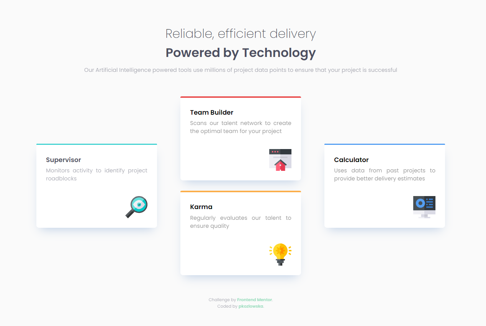
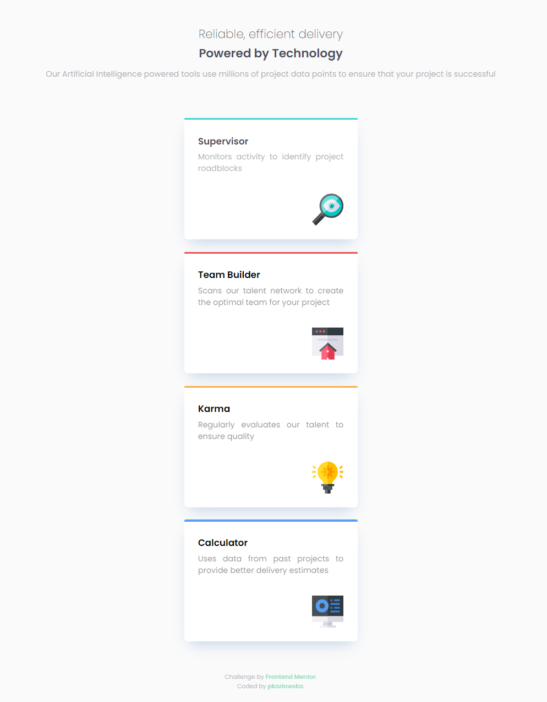

# Frontend Mentor - Four card feature section
This is a solution to the [Four Card Feature Section on Frontend Mentor](https://www.frontendmentor.io/challenges/four-card-feature-section-weK1eFYK/hub)

Desktop version:

Mobile version: 

## The challange

The challange is to: 
- build out designed feature section and get it looking as close to the design as possible.

The user should be able to:
- view the optimal layout for the site depending on their device's screen size.

## Links 

- Live Site URL: [Four Card Feature Section](https://pkozlowska.github.io/four-card-feature-section/)

## Technologies used
- HTML5
- CSS3